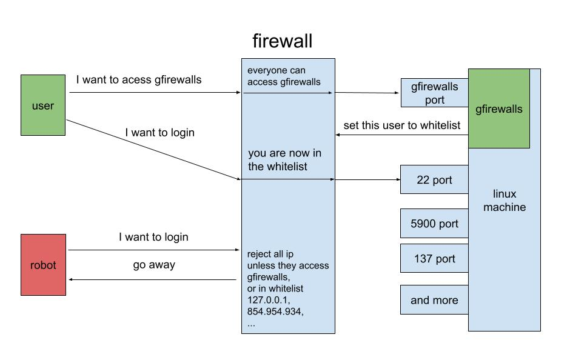

# gfirewalls
A simple and easy to use firewall tool base on ufw.  

### What can it do
Blocking bots from accessing your public network servers.  


### How it work
Run in terminal like this:
```shell
$ sudo java -jar ./gfirewalls.jar --server.port=[GFIREWALLS_PORT]
```

At fist gfirewalls will blocking all ip, user visiting this link with browser to add current ip to whitelist.  
```
http://[YOUR_LINUX_MACHINE_ADDRESSES]:[GFIREWALLS_PORT]/add_this_ip
```

or visiting link in terminal like this:
```shell
$ curl http://[YOUR_LINUX_MACHINE_ADDRESSES]:[GFIREWALLS_PORT]/add_this_ip
```



visiting this link to emptying whitelist:
```
http://[YOUR_LINUX_MACHINE_ADDRESSES]:[GFIREWALLS_PORT]/clear
```
### What it needs
The linux machine you want to protect  

Root or sudo permissions

ufw  
```shell
$ sudo ufw status

# Status active
```
java11  
```shell
$ sudo java -version

# version "11.0.10"
```

## Todo list
1. When run in fist time, backup /etc/ufw/user.rules file 
2. Uninstall and restore /etc/ufw/user.rules file
3. Check the dependent programs  
4. Port whitelist  
5. Some kind of password  
6. IPv6 support

If you find bugs or want to add some new code, please create a pull request or send me an email: gaojizhouqq.com

## License

See the [LICENSE](LICENSE.md) file for license rights and limitations (GPL-3.0).
